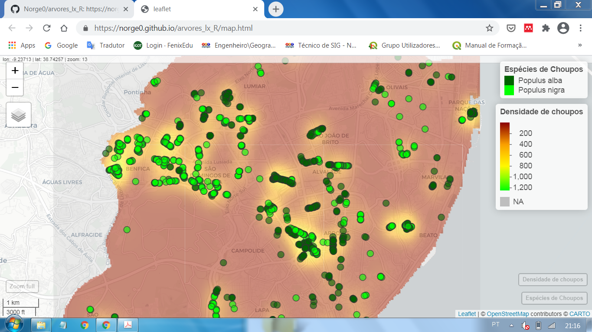

<h3>Árvores em Lisboa</h3><p></p>
Choupos "Populus alba" e "Populus nigra"<br>
Aula prática de programação em R<br>
Unidade Curricular - Geocomputação 2020/21 do Mestrado SIGMTAO do IGOT-UL<p></p>


<h4>Code in R</h4><p></p>

##Instalar e carregar biblioteca para dados espaciais
```
install.packages("raster")
library(raster)
install.packages("rgdal")
library(rgdal
```

##Definir pasta de trabalho
```
setwd("G:/data5")
```

#### Importar shapefiles
```
concelhos = shapefile("concelhos.shp")
arvores_lisboa= shapefile("Arvoredo.shp")
```
